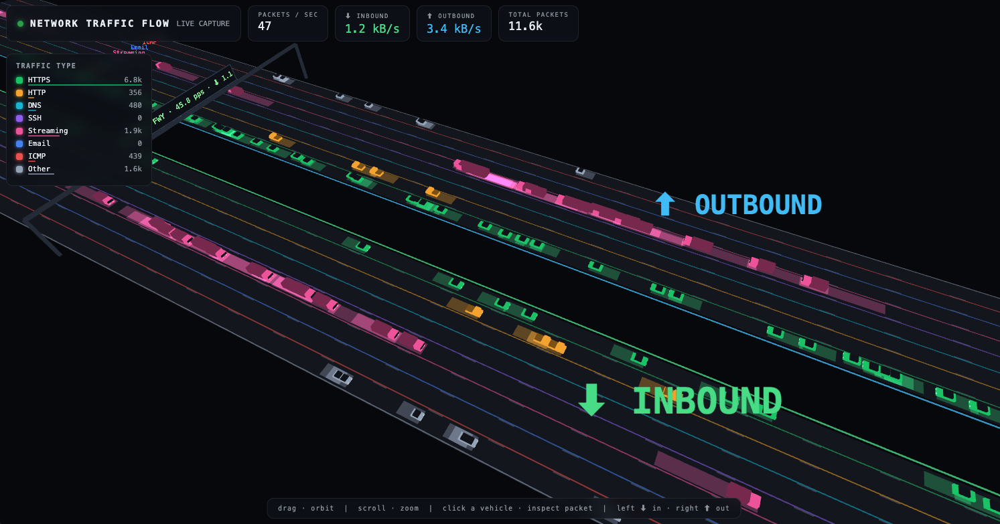

# Network Traffic Flow — 3D Dashboard

A two-way 3D highway visualizing your machine's live network traffic. Each packet is a glowing vehicle: inbound traffic flows down the left roadway, outbound up the right. Lane and color indicate the traffic type.



## Quick start

```bash
cd "~/Claude/Projects/Traffic monitor"
sudo python3 capture.py          # real capture (sudo needed for packet sniffing)
# then open http://localhost:8765/ in your browser
# stop with Ctrl-C
```

No installs needed — the capture script is pure Python stdlib and uses macOS's built-in `tcpdump`.

Other modes:

```bash
python3 capture.py --simulate    # demo traffic, no sudo
sudo python3 capture.py -i en0   # pick an interface
python3 capture.py --no-log      # skip JSONL logging
```

You can also open `dashboard.html` directly as a file — it connects to `localhost:8765` if the feed is running, otherwise it switches itself to simulation mode so you always see something.

## Architecture

```
tcpdump (sudo) ──► capture.py ──► traffic_log.jsonl        (observe + log)
                       │
                       ├──► SSE stream  /events             (live feed, ≤120 evt/s sampled
                       │                                     + exact 1-second stats)
                       ├──► reverse DNS  /resolve?ip=       (cached PTR lookups for the
                       │                                     packet inspector)
                       └──► serves dashboard.html at /
                                   │
                                   ▼
                       Three.js 3D highway (browser)        (visualize)
```

`capture.py` parses tcpdump output, classifies each packet by service, determines direction by comparing against the machine's local IP, appends every packet to `traffic_log.jsonl` (rotated at 50 MB), and broadcasts over Server-Sent Events. Per-packet events are sampled to at most 120/s so the browser never drowns, while a once-per-second `stats` event carries exact totals, packets/sec, and in/out throughput.

The dashboard spawns a vehicle per packet event — vehicle length scales with packet size — and reads the HUD numbers from the exact stats events, so the visualization is illustrative but the numbers are true.

## Traffic categories (lane colors)

| Lane | Category | Match | Color | Vehicle |
|---|---|---|---|---|
| 1 | HTTPS | TCP 443 | green | sedan |
| 2 | HTTP | TCP 80/8080 | amber | pickup truck |
| 3 | DNS | 53, 5353 | cyan | motorcycle (fast) |
| 4 | SSH | TCP 22 | violet | armored truck |
| 5 | Streaming | UDP 443 (QUIC), RTMP, RTSP, STUN/WebRTC | pink | semi-trailer (trailer grows with packet size) |
| 6 | Email | SMTP/IMAP/POP ports | blue | mail van |
| 7 | ICMP | ping etc. | red | emergency car, flashing beacon |
| 8 | Other | everything else | gray | compact |

Each roadway has 8 lanes, one per category, with a color-coded edge strip and floating lane labels. Speed reflects the vehicle class — motorcycles zip, semis lumber, the ICMP emergency car flies.

## Controls

Drag to orbit, scroll to zoom, **click any vehicle** to inspect the packet it represents (type, direction, src → dst, ports, bytes). When an IP has a reverse-DNS record, the inspector swaps the address for its domain name (with the IP in parentheses) — lookups are served by `capture.py` at `/resolve?ip=` and cached, so it stays fast. Some IPs (notably CDNs) have no PTR record and keep showing the bare address. An overhead gantry billboard shows the live traffic report. Status dot: green = live capture, amber = simulation.

## Troubleshooting

`tcpdump: ioctl(SIOCIFCREATE): Operation not permitted` — harmless macOS warning (libpcap probing for a pktap device). If the dashboard shows LIVE and traffic flows, ignore it. If nothing flows, pin the interface: `sudo python3 capture.py -i en0` (find yours with `ifconfig` — usually `en0` for Wi-Fi).

## Log format

One JSON object per packet in `traffic_log.jsonl`:

```json
{"ts":1781225781.0,"dir":"in","cat":"HTTPS","proto":"tcp","len":1495,"src":"64.203.132.231","dst":"192.168.1.10","sport":443,"dport":53060}
```

## Files

`capture.py` — sniffer, classifier, logger, SSE + reverse-DNS server. `dashboard.html` — single-file Three.js visualization. `traffic_log.jsonl` — packet log (created at runtime). `screenshot.png` — dashboard capture shown above. `CLAUDE.md` — development notes and architecture decisions.
